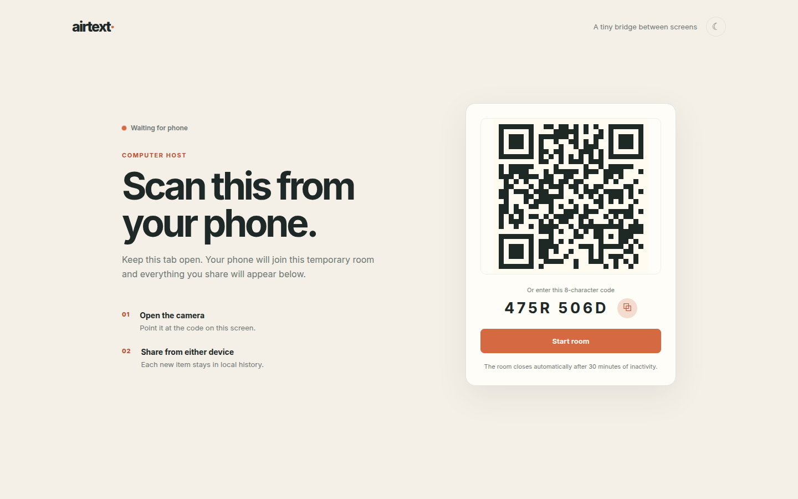

# airtext

A small clipboard bridge between a computer and a phone. Open the app on the computer, scan its QR code from the phone, and share text between both screens.

**→ Try the live demo: [airtext.holistic.workers.dev](https://airtext.holistic.workers.dev/)** (camera access recommended for QR pairing)



## How pairing works

1. Choose **Use this computer**. A temporary room opens automatically and displays a QR code plus an 8-character fallback code.
2. Choose **Use this phone** on the phone, scan the QR, or enter the fallback code.
3. After both browsers show **Connected**, share text from either composer.
4. Each browser keeps its own bounded history in IndexedDB. Nothing is associated with an account.

## Privacy and limits

- Room codes are temporary bearer capabilities. Leave the room or start over to invalidate the current connection.
- Invite links carry the room code in the URL fragment (`#join=…`), which browsers never transmit to the server.
- Only two browser connections are allowed in a room.
- Clipboard text is forwarded to the other live browser and is not persisted by the Worker.
- Text is rendered as text, never as HTML.
- Text entries are capped at 100,000 characters and each local history is capped at 100 entries.
- Camera and clipboard permissions are controlled by the browser. HTTPS is required by modern browsers for those APIs.

## Architecture

Cloudflare Workers Static Assets for the Vite build, one Durable Object instance per temporary room for WebSocket signaling/relay. Room relay keeps content in memory only, does not write clipboard text to Durable Object storage, and closes idle rooms.

## Local development

```bash
npm install
npm run dev
```

The app works as a visual client over Vite. Camera and clipboard APIs require a secure context, so test the full flow on the HTTPS deployment above or through a local HTTPS proxy. The Worker room relay is exercised with Wrangler:

```bash
npm run build
npx wrangler dev
```

## Deploy to Cloudflare

```bash
npm install
npm run deploy
```

Before the first deploy, authenticate Wrangler with `npx wrangler login` and confirm that Durable Objects are available under the account's current free allocation.

## Checks

```bash
npm run build
npm test
npm run lint
```
